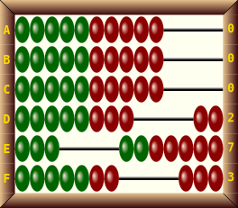
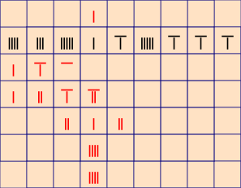
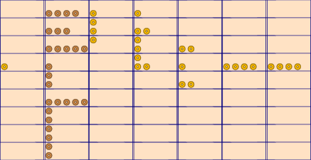

# Intro:

This package contains three `Python3` scripts for drawing diagrams or illustrations of various types of abacuses in `SVG` (Scalable Vector Graphics).

* `svg-abacus`: Abacuses of the soroban and swanpan family.
* `svg-schoty`: Russian (schoty), school or Danish and Mesopotamian (sexagesimal) abacuses.
* `svg-sangi`: Japanese-style counting rods (sangi), medieval European counting table and an imaginary  Mayan (vigesimal) free counter abacus.

These are command-line utilities. Tested with `Python 3.11.2` under Debian GNU/Linux 12 (bookworm).

## Installation:
No special installation is required since only the standard `argparse` and `sys` modules are used.

* On Unix-like systems, make sure to make the files executable and move them anywhere in your `PATH`.
* Alternatively, rename the files to contain the `.py` extension and invoke them from your Python interpreter:

    `$ python3 svg-abacus.py ...`

# svg-abacus
Simple `python3` script to draw SVG diagrams or illustrations of several (oriental) abacus types. 

## Supported abacus types: 
* 4+1, Modern soroban/suanpan (そろばん/算盤, 算盘) (option: `-41`, support suspended lower beads)
* 4+3, Nepohualtzintzin and Inupiaq abacuses (option: `-43`)
* 5+1, Traditional soroban (option: `-51`, support suspended lower beads)
* 5+2, Traditional suanpan and soroban (option: `-52`)
* 5+3, Rare traditional suanpan (option: `-53`), the "complete abacus"
* 9+3, Sexagesimal or Mesopotamian abacus organized as an  oriental abacus (option: -95)

## Bead types:
* Japanese style (default)
* Chinese style (option: `-c`)

## Unit rod marks (dots):
* Every 3 rods from center (option: `-d 3`)
* Every 4 rods from center (Pre-WWII soroban option: `-d 4`))
* No marks (default or option: `-d 0`)

## Support for suspended beads:
* The 5+2 abacus uses the suspended top bead to represent numbers up to 20 in a column. This is required for some traditional techniques such as Kijoho division.
* Suspended lower beads can be used for the same purpose on the 4+1 and 5+1 abacuses (see [The Eastern Abacus](https://jccsvq.github.io/libro-abaco/index-tea.html#XIV%3A%20Second%20way%3A%20Suspended%20lower%20beads)).

## Labels:
* Columns can be labeled with capital letters from A to Z (option `-n`).
* Columns can be labeled with the values/codes used to create them (option `-k`). These annotations are grouped at the end of the SVG file to allow for easy manipulation/editing (e.g., remove the "`0`" label for unused columns).

## Codes:

|Abacus|Codes|
|------|-----|
|4+1|0 1 2 3 4 5 6 7 8 9 0s 1s 2s 3s 4s 5s 6s 7s 8s 9s|
|4+3|0 1 2 3 4 5 6 7 8 9 10 11 12 13 14 15 16 17 18 19|
|5+1|0 1 2 3 4 5 6 7 8 9 0s 1s 2s 3s 4s 5s 6s 7s 8s 9s  F T|
|5+2|0 1 2 3 4 5 6 7 8 9 11 12 13 14 16 17 18 19 20 F t T q Q|
|5+3|0 1 2 3 4 5 6 7 8 9 11 12 13 14 16 17 18 19 20 F t T q Q|

|Symbol|Meaning|
|--|--|
|s|Suspended lower bead|
|F|Lower 5|
|T|Lower 10|
|t|Upper 10|
|Q|Lower 15|
|q|Upper 15|

...

## Example:

    $ echo 0 0 0 0 0 0 5 1 2 3 4 9 1|./svg-abacus -t 53 -s 25 -c -d 3 -b  > example.svg

Creates a diagram in `example.svg` for a 13 rods 5+3 abacus at a scale of 25 pixels/rod,
with chinese style beads, no unit rod marks and non-transparent background. Rod values are read from stdin.

    $ echo 0 0 0 0 0 F 5 1 2 3 4 9 1 0 0 0 0|./svg-abacus -t 51 -s 25 -d 4 -bl  > example2.svg

 

Number: 53:59:49:12 (decimal: 11 663 352)

    echo 00 53 59 49 12 | ./svg-abacus -cft 95  -bkn -s 25 --tcolor orange > test-results/95cfbkn.svg

Folder `test-results` contains many other examples created by the `bash` script `test.bash`.

## Options:

Use:    `$ svgabacus [-h | --help]` for options.

    usage: svg-abacus [-h] [-t {41,43,51,52,53,95}] [-c] [--ccolor CCOLOR]
                      [--ccolor2 CCOLOR2] [-d {0,3,4}] [-s SCALE] [-v VALUES] [-b]
                      [--bgcolor BGCOLOR] [-f] [-l] [-n] [-k] [--tcolor TCOLOR]
                      [-o OUTPUT]
    
    Draws diagrams for several abacus types by reading column values from stdin.
    
    options:
      -h, --help            show this help message and exit
      -t {41,43,51,52,53,95}, --type {41,43,51,52,53,95}
                            Abacus type (default: 53)
      -c, --chinese         Use Chinese style beads (default: False)
      --ccolor CCOLOR       Chinese style beads color (default: Darkgreen)
      --ccolor2 CCOLOR2     Chinese style bead 2 color (default: Darkred)
      -d {0,3,4}, --dots {0,3,4}
                            Unit rod dots every 3 or 4 rods (0 to no dots at all)
                            (default: 0)
      -s SCALE, --scale SCALE
                            Nominal rod width in pixels (default: 100)
      -v VALUES, --values VALUES
                            String of column values separated by spaces. If not
                            used, data is read from stdin (default: None)
      -b, --background      Non-transparent background (default: False)
      --bgcolor BGCOLOR     Non-transparent background color (default: Ivory)
      -f, --frame           Adjust to abacus frame (cut transparent borders)
                            (default: False)
      -l, --lacquered       Use lacquered frame (default: False)
      -n, --names           Add column names/labels A, B, C, ... (default: False)
      -k, --keys            Labels columns with codes (default: False)
      --tcolor TCOLOR       Text color (default: Gold)
      -o OUTPUT, --output OUTPUT
                            Output filename (default: None)

# svg-schoty
Simple `python3` script to draw SVG diagrams or illustrations of the Russian abacus family

## Supported abacus types: 

* Russian schoty (Счёты) and Iranian  chortkeh (چرتکه)
* Danish or school  abacus
* Mesopotamian (sexagesimal), imagined here as a variant of the Russian abacus

## Examples:

* Russian
* 

* Danish
* 

* Old chotkeh (9 beads)
* 

* Mesopotamian (sexagesimal), using codes `m0, m1, ... m6`. For instance, number 00:34:52 (decimal 2092) coded as `0 0 m3 4 m5 2`:
* 

* Mesopotamian on 9 bead abacus:
* 

## Codes:

|Abacus|Codes|
|------|-----|
|Russian|0 1 2 3 4 5 6 7 8 9 10 0k 1k 2k 3k 4k 5k 6k 7k 8k 9k 10k q0 q1 q2 q3 q4 m0 m1 m2 m3 m4 m5 m6|
|9 beads|0 1 2 3 4 5 6 7 8 9 0k 1k 2k 3k 4k 5k 6k 7k 8k 9k m0 m1 m2 m3 m4 m5|
|Danish|0 1 2 3 4 5 6 7 8 9 10|

## Options:

    usage: svg-schoty [-h] [-d] [-s SCALE] [-v VALUES] [-b] [--bgcolor BGCOLOR]
                      [--b1color B1COLOR] [--b2color B2COLOR] [--b3color B3COLOR]
                      [--b4color B4COLOR] [-n] [-k] [-o OUTPUT]

    Draws diagrams for Russian and Danish abacuses by reading row values from
    stdin.

    options:
      -h, --help            show this help message and exit
      -d, --danish          Use Danish/school abacus (default: False)
      -9, --nine            Use nine beads (some old chortkeh) (default: False)
      -s SCALE, --scale SCALE
                        Nominal rod width in pixels (default: 100)
      -v VALUES, --values VALUES
                        String of column values separated by spaces. If not
                        used, data is read from stdin (default: None)
      -b, --background      Non-transparent background (default: False)
      --bgcolor BGCOLOR     Non-transparent background color (default: Ivory)
      --b1color B1COLOR     Bead 1 color (default: DarkGreen)
      --b2color B2COLOR     Bead 2 color (default: DarkRed)
      --b3color B3COLOR     Bead 3 color (default: DarkBlue)
      --b4color B4COLOR     Bead 4 color (default: Black)
      -n, --names           Add column names/labels A, B, C, ... (default: False)
      --mnames              Add alternate column names/labels A, a, B, b, ...
                            (default: False)
      -k, --keys            Labels columns with codes (default: False)
      --tcolor TCOLOR       Text color (default: Gold)
      -o OUTPUT, --output OUTPUT
                            Output filename (default: None)

# svg-sangi

 Simple `python3` script to draw SVG diagrams or illustrations of Japanese style counting rods (sangi 算木), medieval European counting boards and an imaginary  mayan (vigesimal) free counter abacus.

This script requires a data file to be piped; example:

`$ cat datos.txt |./svg-sangi -s 66 --ncolor black > test-results/sangi.svg`

 with `datos.txt` containing, for instance:

    0 9 3 7
    0 0 -7 -F
    1 0 7 6

Or you can give the file name on the command line (option [-i | --input])

`$ ./svg-sangi -s 66 --ncolor black -i datos.txt > test-results/sangi.svg`

## Supported abacus types: 

* Japanese style counting rods (sangi 算木)
* Medieval European counting boards
* Mayan abacus

## Examples:
* Sangi counting rods
* 
* 
*  Medieval European counting board
* 
* 
*  Mayan
* 
*
## Codes:
Use the same codes as with the oriental abacus type 5+2 or 5+3. For the Mayan zero, use `z` or `-z`.

## Options:

    usage: svg-sangi [-h] [-t {s,e,m}] [-i INPUT] [-s SCALE] [--prcolor PRCOLOR]
                     [--nrcolor NRCOLOR] [--pjcolor PJCOLOR] [--njcolor NJCOLOR]
                     [--bgcolor BGCOLOR] [--lcolor LCOLOR] [-o OUTPUT]
    
    Draws diagrams of Japanese style counting rods (sangi), medieval European
    counting boards and an imaginary Mayan (vigesimal) abacus by reading from stdin or file.
    
    options:
      -h, --help            show this help message and exit
      -t {s,e,m}, --type {s,e,m}
                            Abacus type: s (sangi), e (european), m (mayan)
                            (default: s)
      -i INPUT, --input INPUT
                            Data filename to read (default: None)
      -s SCALE, --scale SCALE
                            Nominal cell height in pixels (default: 100)
      --prcolor PRCOLOR     Color for positive rods (default: Red)
      --nrcolor NRCOLOR     Color for negative rods (default: Black)
      --pjcolor PJCOLOR     Color for positive jetons (default: #ffbf00)
      --njcolor NJCOLOR     Color for negative jetons (default: #ce8946)
      --bgcolor BGCOLOR     Background color (default: #ffe2c4)
      --lcolor LCOLOR       Color for separation lines (default: Navy)
      -o OUTPUT, --output OUTPUT
                            Output filename (default: None)

